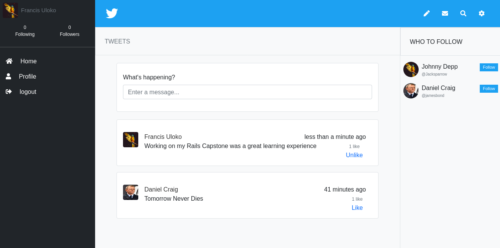

# Ruby on Rails Capstone Project (Twitter Redesign)

> This is a solo project to build a site similar to twitter where users can share their opinions on different topics.




This project demonstrates my overall understanding of Ruby on Rails. In building this project, I have:

- Use MVC architectural pattern
- Configure RESTFUL routes
- Use controllers to intercept user requests
- Use view templates for HTML with embedded data
- Connect Database to app using postgres
- Use Active Record as ORM
- Use Active Record associations to model real life system (based on Database schema)
- Use Active Record queries to translate app requirements to SQL queries
- Use ActiveRecord validations
- Pass user input from view through controller to model in a safe way
- Remember about thin controllers and distinction between logic and presentation tiers
- Avoid n+1 queries problem
- Use unit tests (Rspec)
- Use ActiveRecord validations
- Deploy apps heroku
- Translate business requirements into software solutions

## Built With

- Ruby v3.0.1
- Ruby on Rails v6.1.3
- Bootstrap
- yarn
- Rspec

## Live Demo

[Twitter_redesign](https://)


## Getting Started

To get a local copy up and running follow these simple steps.

- To get a local copy of this project, run
`git clone https://github.com/francisuloko/twitter-redesign-capstone.git`

- Change into the project directory, run
`cd twitter-design-capstone`

### Prerequisites

Ruby: >=2.6.3
Rails: >=5.2.3
Postgres: >=9.5

### Setup

Install gems with:

```
bundle install
```

Setup database with:

```
   rails db:create
   rails db:migrate
```

### Usage

Start server with:

```
    rails server
```

Open `http://localhost:3000/` in your browser.

### Run tests

```
    rpsec --format documentation
```

### Close Terminal

```
    Ctrl + C
```

## Author

👤 **Francis Uloko**

- [Github](https://github.com/francisuloko)
- [Twitter](https://twitter.com/francisuloko)
- [LinkedIn](https://linkedin.com/in/francisuloko)

## 🤝 Contributing

Contributions, issues and feature requests are welcome!

Feel free to check the [issues page](https://github.com/francisuloko/twitter-redesign-capstone/issues).

## Show your support

Give a ⭐️ if you like this project!

## Acknowledgments

- The Odin Project
- Ruby on Rails Guide
- Gregoire Vella for inspiration on Behance

## 📝 License

This project is [MIT](https://mit-license.org) licensed.
